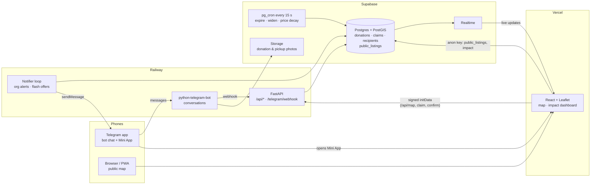

# KainTabe: real-time food redistribution

*AppCon 2026 · Team Trie Code · Iloilo City*

Restaurants, bakeries and households message surplus food to a **Telegram bot**. The listing appears on a **live map** with a countdown. The **nearest partner kitchen** gets an alert and claims it in one tap. If nobody claims it, the **search radius widens** on its own, and at the limit nearby **individuals get a flash offer**. Pickups are **confirmed with a photo**, and an **impact dashboard** counts the kilograms, meals and CO₂e saved.

- **Live map:** https://appcon2026-team-triecode-kaintabe.vercel.app (public view: approximate areas only)
- **Bot:** [@KainTabe_bot](https://t.me/KainTabe_bot)
- **Demo run sheet:** [docs/DEMO.md](docs/DEMO.md)

## What each person does

| Role | Where | What they can do |
|------|-------|------------------|
| **Donor** (business or household) | Telegram bot | Sign up (name, type, location, safety pledge). Post food by sending a photo, then answer food, quantity and "good for" hours plus a 3-question safety checklist. Businesses can **sell at a falling price** instead of donating. `/mylistings` shows their listings and takes down food that's already gone. |
| **Partner org** (kitchen, shelter, pantry) | Telegram bot + map inside Telegram | Sign up in the bot (shown as *pending review*). Gets an alert for food within its radius and claims it from the alert or the map. Confirms pickup by sending a photo. |
| **Individual** | Telegram bot | Opts in to flash offers near them. Food that no org took is offered to them. `/stop` pauses offers. |
| **Anyone** | Browser | Read-only live map (approximate ~500 m areas, no names or photos) and the Impact tab. Can be installed as an app (PWA). |

## Architecture



**How a listing moves**

```
posted ──(org claims)──▶ claimed ──(pickup photo)──▶ completed / sold
  │  every widen period with no claim: radius 2 → 4 → 8 km
  ▼
escalated ──▶ flash offers to individuals ──(claims)──▶ claimed
Any live listing: past its "good for" time ─▶ expired · donor takes it down ─▶ withdrawn
Claimed but never picked up: 1 h after expiry ─▶ expired
```

**Key design choices**

- **The database owns the rules.** Claiming is one atomic SQL function (`claim_donation`), so two orgs tapping at once can't both win. Widening, expiry and sale-price decay run in `pg_cron`, so they keep working even if the backend restarts.
- **Telegram is the login.** Inside the Mini App, Telegram signs who the user is (`initData`). The backend checks the HMAC with the bot token, so there are no passwords, and nobody can act as an org they aren't.
- **Privacy is enforced on the server, not the page.** The browser's anon key can't read `donations`, `claims` or individuals at all. It reads `public_listings`, a trigger-maintained copy with coordinates snapped to a ~500 m grid and no names or photos. Exact details come only from `/api/map`: donors see their own listings, orgs see what's in their range, and individuals see what they claimed.
- **Send once.** Org alerts and flash offers insert a row first (`org_alerts`, `flash_offers`) and send only if the insert succeeded, so restarts or two workers never double-message anyone. Nobody is alerted about their own food.
- **Restart-safe bot.** Conversation state is persisted in Postgres (`bot_state`), so a deploy in the middle of a post doesn't lose it.

**Stack:** FastAPI · python-telegram-bot 21 · Supabase (Postgres, PostGIS, pg_cron, Realtime, Storage) · React 19 · Vite · Tailwind 4 · Leaflet · Recharts. Hosted on Railway (API + bot) and Vercel (web).

## Repository

```
backend/    FastAPI app, Telegram bot, services, pytest suite
  app/bot/        conversations (onboarding, posting, org sign-up, /mylistings) + DB persistence
  app/services/   repo (SQL), notifier (org alerts, flash offers), telegram, storage, AI intake
  app/routes.py   /api: config, me, map, claims, confirm, withdraw
frontend/   React web app (map, cards, phone bottom sheet, impact dashboard, PWA manifest)
supabase/   migrations/ (numbered, applied in order) and seed.sql (Iloilo orgs + demo donors)
scripts/    apply_sql, demo, demo_mode, sim_post, seed_demo_history, ai_try  (frontend/scripts/make-icons.mjs: PWA icons)
docs/       DEMO.md: stage run sheet
```

## Running locally

**Needs:** Python 3.10+, Node 22, a Supabase project with PostGIS and pg_cron enabled, and a Telegram bot token from @BotFather. Use a separate dev bot so local testing never touches the live bot.

1. **Env files:** copy `backend/.env.example` → `backend/.env` and `frontend/.env.example` → `frontend/.env`, then fill them in.
2. **Database:**
   ```sh
   cd backend && python -m venv .venv && .venv/Scripts/pip install -r requirements.txt && cd ..
   backend/.venv/Scripts/python scripts/apply_sql.py --seed
   ```
3. **Backend + bot** (polling mode):
   ```sh
   cd backend && .venv/Scripts/python -m uvicorn app.main:app --port 8000
   ```
   - Don't use `--reload`: on Windows the bot's long poll blocks the reloader, so restart by hand.
   - Only one process may poll a bot at a time. Use `BOT_MODE=off` to run the API without the bot.
4. **Frontend:**
   ```sh
   cd frontend && npm install && npm run dev
   ```
   Leave `VITE_API_URL` empty. Vite forwards `/api` to `127.0.0.1:8000`.
5. **Testing the Mini App on a phone (optional).** Telegram only opens HTTPS pages, so tunnel the local site:
   ```sh
   cd frontend && npm run build && npx vite preview --host 127.0.0.1 --port 5173
   cloudflared tunnel --protocol http2 --url http://localhost:5173
   ```
   Put the printed `https://….trycloudflare.com` URL in `WEB_URL` in `backend/.env` and restart the backend. The bot's 🗺️ Map button then opens it. The production build loads much faster in Telegram than the dev server.

**Tests:** `cd backend && .venv/Scripts/python -m pytest -q`.
- The tests run against the real database, but every test works inside a transaction that is rolled back.
- Rows the tests must commit are tagged and cleaned up.
- The Telegram API is faked.

## Deployment

- **Railway** (`backend/`) runs `BOT_MODE=webhook` with `PUBLIC_URL`, `WEBHOOK_SECRET`, `FRONTEND_ORIGIN` and `WEB_URL` set to the Vercel URL. On startup it registers the webhook, the bot commands and the 🗺️ Map menu button.
- **Vercel** (`frontend/`) builds with `VITE_SUPABASE_URL`, `VITE_SUPABASE_ANON_KEY` and `VITE_API_URL` set to the Railway URL.
- **Pushing to `main`** deploys both. Migrations are applied by hand with `scripts/apply_sql.py`. They are additive, so the running version keeps working in between.

## Scripts

Run from the repo root with `backend/.venv/Scripts/python scripts/<name>`.

| Script | Purpose |
|--------|---------|
| `apply_sql.py [--seed] [--until NNN]` | Apply pending migrations (each in one transaction) and optionally the seed. |
| `demo.py status\|prepare\|post\|claim\|confirm\|escalate\|reset\|wipe` | Stage helper: plays the org and donors you don't have a second phone for; `wipe` starts the database from scratch (keeps the seed and sample history). In the bot, the owner-only `/demo donor\|org\|individual\|fresh\|all` switches which role your account plays. See [docs/DEMO.md](docs/DEMO.md). |
| `demo_mode.py on [min]\|off` | Widen and sale-price timers: 1 min on stage, 10/60 min for real. |
| `sim_post.py [--sale P] [--clear]` | Post a simulated listing, or delete all simulated rows. |
| `seed_demo_history.py [--replace]` | A week of **sample** pickups for the dashboard, tagged so it can be removed. |
| `ai_try.py <photo>` | Try the Claude vision intake on a photo (needs `ANTHROPIC_API_KEY`). |

## Impact numbers

- **Meals:** kg ÷ 0.4 kg per meal.
- **CO₂e avoided:** kg × 2.5 kg CO₂e per kg of food (FAO 2013, Food Wastage Footprint; cited on the Impact tab).
- **Counted pickups:** only confirmed ones.
- **Sample history:** the seeded days are sample data, tagged `seed_history`.

## Not done yet

- **AI photo intake:** built, but dormant until an Anthropic API key with credits is set.
- **Real org verification:** registration papers or an LGU endorsement.
- **Filipino-language bot text.**
- **A separate staging database.**
